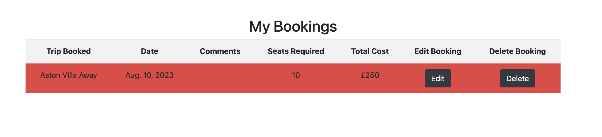

# Manchester United Supporters Away Travel Company


Github link to the project [Github link](https://github.com/RichBurman/Project_4)

Live Link to the project website [Live link](https://rbproject-4-c2dc0a612356.herokuapp.com)

## CONTENTS

- [Manchester United Supporters Away Travel Company](#manchester-united-supporters-away-travel-company)
  - [CONTENTS](#contents)
  - [User Experience (UX)](#user-experience-ux)
    - [Key Information for the site](#key-information-for-the-site)
    - [User Stories](#user-stories)
      - [Client Goals](#client-goals)
      - [First Time Visior Goals](#first-time-visior-goals)
      - [Returning and Frequent Visitor Goals](#returning-and-frequent-visitor-goals)
  - [Design](#design)
    - [Colour Scheme](#colour-scheme)
    - [Typography](#typography)
    - [Imagery](#imagery)
    - [Wireframes](#wireframes)
  - [Features](#features)
    - [Future Implementations](#future-implementations)
  - [Technologies Used](#technologies-used)
    - [Languages Used](#languages-used)
    - [Frameworks](#frameworks)
    - [Libraries \& Programs Used](#libraries--programs-used)
    - [Accessibility](#accessibility)
  - [Deployment \& Local Development](#deployment--local-development)
    - [Deployment](#deployment)
      - [**Create the Live Database**](#create-the-live-database)
      - [**Heroku app setup**](#heroku-app-setup)
      - [**Preparation for deployment in Codeanywhere**](#preparation-for-deployment-in-codeanywhere)
    - [Local Development](#local-development)
      - [How to Fork](#how-to-fork)
      - [How to Clone](#how-to-clone)
  - [Testing](#testing)
    - [Fully Testing](#fully-testing)
    - [W3C Validator](#w3c-validator)
    - [Solved Bugs](#solved-bugs)
    - [Known Bugs](#known-bugs)
    - [Lighthouse](#lighthouse)
      - [Index Page](#index-page)
      - [My Bookings](#my-bookings)
      - [New Bookings](#new-bookings)
      - [Edit Bookings](#edit-bookings)
      - [Booking Success](#booking-success)
  - [Credits](#credits)
    - [Code Used](#code-used)
    - [Content](#content)
    - [Media](#media)
    - [Acknowledgments](#acknowledgments)

---

## User Experience (UX)

- Manchester United Supporter Travel Company is a online coach booking club that allows football supporters (Users) to book couch travel to a specific football match. The site allows supporters to view upcoming couch trips for upcoming games and book seats on the coach so they can travel in style to the football game.

### Key Information for the site

- What trips are available to book.
- Trip Details.
- How to create, edit and delete a booking.
- To be able to review what bookings you have.
- How to become a member and sign up.
- User can see a live upcoming trip list on the home page which is updated as users on the site make bookings.
-

### User Stories


The user stories were split into User and Admin.

User

- As a Site User I can register an account so that I create and edit my trip bookings
- As a Site User I can view a list of trips so that I can select one/many to book
- As a Site User I can click on a trip so that I can find out full information about the trip and decide if I want to book
- As a Site User I can create, read, update and delete bookings so that I can manage my trip bookings
- As a User I can **make a booking and have the cost displayed** so that I see how much the trip will cost based on how many seats I have booked

Admin

    - As a Admin I can create Trips so that Users can book onto the trips
    - As a Admin I can create, read, update and delete any bookings so that I can manage the booking system

#### Client Goals

- To be able to view the site on a range of device sizes.
- To make it easy for potential memebers to find a Trip and book seats easily.
- To make it clear for members to create, edit and delete bookings.

#### First Time Visior Goals

- I want to find out what Manchester United Travel Company is and how I can take part.
- I want to be able to navigate the site easily to find information.
- I want to be able to find their social links.

#### Returning and Frequent Visitor Goals

- I want to find upcoming trips and be able to book onto them.
- I want to be able to view, edit and delete my bookings.

## Design

### Colour Scheme


- The website uses a palette of reds, whites and blacks that are linked to the colors of Manchester United. The color palette was created using the [Coolors](https://coolors.co/) website.

### Typography

- Default fonts were used for the following:
- Headings
- Body
- Messages

### Imagery

- Images were used from the [Unsplash](https://unsplash.com/) website.

### Wireframes

- Wireframe were created which are linked below:
- 

## Features

The website is comprised of five pages:

- Index Page (Home)
- My Bookings
- New Booking
- Booking Success
- Edit Booking

Three of the pages are accessible from the navigation bar (Home, My Bookings, and New Booking, however this is dependant on whether a User has registered and is logged in, as some links are only visiable to logged in registered users)

Booking success is only visiable to a user, once they have created a booking. Edit booking is only visiable to a user once they edit an existing booking.

- ALl Pages on the website have:

- If user has registered and logged in:
- A responsive navigation bar at the top which allows the users to navigate through the site. To the left of the navigation bar is a space that when a user is registered and logged in displays Welcome 'User Name', this indicts to the user that they are logged in. To the right of this, are the links to the website pages (Home, Logout, My Bookings, New Booking). To allow a good user experience of the site, which the website is shown on smaller devices, the navigation bar changes to a burger toggler. This was implemented to give the site a clean look and to promote a good user experience, as users are used to seeing the burger icon when on smaller devices to navigate a site.
- If the user is not logged in:
- A responsive navigation bar at the top which allows the user to navigate through the site. The navigation bar has links to (Register and Login). All other links are hidden from non registered user, as the website requires you to be a registered user to make a booking. To allow a good user experience of the site, which the website is shown on smaller devices, the navigation bar changes to a burger toggler. This was implemented to give the site a clean look and to promote a good user experience, as users are used to seeing the burger icon when on smaller devices to navigate a site.

- A footer which contain social media icon links to Facebook, Twitter, YouTube and Instagram. Icons were used as it keeps the footer clean and becuase they are universally recognisable.

- Home Page


- A clear heading informing the user what the site is about.
- A basic section giving information to the user about the services offered by the website.
- A live Upcoming Trip list, which displays the following to the user:
- Trip ID - this is the ID number of the trip
- Trip Name - this display the name of the upcoming trip to the user, informing them of the destination of the trip
- Seats - Informing the user how many seats the coach has and therefore how many seats are available to book on each trip
- Remaining Seats - Informs the user how many seats are available to book. This is a live number as once a user books a number of seats, it is subtracted from this number.
- Price - the price of booking a seat on this trip.


- Navigation Bar
  - The navigation bar allows users and visitors to navigate around the site.
Visitors


- Home - to take the user to the Home Page
- Register - to take the user to the register/sign up page
- Login - to take the user to the login page
Registered logged in User


- Welcome Username - Displays a welcome message and the user's username
- Logout - allows the user to logout of the website
- Home - take user to the Home Page
- My Bookings - take the user to My Bookings to view their bookings
- New Booking - take the user to the new booking page to create a new booking

Admin logged in User


- Welcome admin - Displays a welcome message and the admin name
- Logout - allows the user to logout of the website
- Home - take user to the Home Page
- My Bookings - take the user to My Bookings to view their bookings
- New Booking - take the user to the new booking page to create a new booking
- Admin - allows the admin to enter the [Admin Page](https://rbproject-4-c2dc0a612356.herokuapp.com/admin/)

- My Bookings



- This page displays to the user their bookings. It shows booking that are assigned to them.
- Trip Booked
- Trip Date
- Comments - Any comments the user made when they made their booking.
- Seats Required - how many seats the user booked.
- Total Cost - How much the total booking costs. It is the sum of the trip cost x seats required.
- Edit Button - this allows the user to enter the booking and edit the booking. (Directs them to the editbooking page)
- Delete Button - this allows the user to delete the booking.

* New Booking


- This page contains a form which allows the user to make a new booking. It contains fields for the following:

- Date of Booking - This is set as a default of today's date, but can be edited by the user.
- Selected Trip - This is a dropdown list, which allows the user to select from the Trips that are available to book.
- Numbers of Seats Required - This allows the user to input how many seats they would like to book.
- Additonal Comments - This field allows the user to input any comments about the booking that they want to make when they make their booking.

Once a user confirms a booking it will update the live upcoming trip section on the home page


As well as add the booking to the user my booking section.


- Edit Booking

* - This page contains a form which allows the user to edit an existing booking. It contains fields for the following:
* Date of Booking - This is set as a default of today's date, but can be edited by the user.
* Selected Trip - This is a dropdown list, which allows the user to select from the Trips that are available to book.
* Numbers of Seats Required - This allows the user to input how many seats they would like to book.
* Additonal Comments - This field allows the user to input any comments about the booking that they want to make when they make their booking.

- It allows the user to edit a existing booking and will update the database accordingly.

- Booking Success

  

* The page contains a booking confirmation summary. It display the following to the user:
* The name of the trip booked.
* Number of Seats booked.
* The total cost of the booking.

### Future Implementations

- Create a About Us Page - to provide visitors and users of the site more information about the Manchester United Travel Company
- Create a system where the User can pay for bookings online. At the moment the user merely makes the booking online and this is assigned to them. I would like to create a payment system where the user can pay for the booking and then this will provide them with a booking reference they can provide to the coach driver on the day to gain access to the coach.
- A gallery page where the visitors/users can view images of previous trips to improve the user experience.
- A Booking Trip page, where the user can view multiple upcoming bookings and this will also display which trips are sold out, close to being sold out etc.

## Technologies Used

### Languages Used

HTML, CSS, Javascript, Python and Django

### Frameworks

Django - A high-level Python web framework that encourages rapid development and clean, pragmatic design.

Balsamiq - Used to create WireFrames

Codeanywhere - For version control

Github - To save and store the files for the website

Bootstrap - The framework for the website.

Google Dev Tools - To troubleshoot and test features, solve issues with responsiveness and styling.

[Am I Responsive](http://ami.responsivedesign.is/) To show the website on a range of devices.

### Libraries & Programs Used

Font Awesome - For the icongraphy on the website.

Django Allauth

Django_crispy_forms

gunicorn

dj_database_url

psycopg2

Pip - for install python packages

### Accessibility

- I have been mindful during the coding to ensure that the website is as accessible friendly as possible. I hav eachieved this by:
- Using semantic HTML.
- Using descriptive alt attributes on images on the site.
- Ensuring that there is a sufficient colour contrast throughout the site.
- Ensuring menus are accessible by marking the current page as active for screen readers.

## Deployment & Local Development

### Deployment

The project is deployed using Heroku. To deploy the project:

#### **Create the Live Database**

We have been using the sqlite3 database in development, however this is only available for use in development so we will need to create a new external database which can be accessed by Heroku.

1. Go to the [ElephantSQL](https://www.elephantsql.com/) dashboard and click the create new instance button on the top right.
2. Name the plan (your project name is a good choice), select tiny turtle plan (this is the free plan) and choose the region that is closest to you then click the review button.
3. Check the details are all correct and then click create instance in the bottom right.
4. Go to the dashboard and select the database just created.
5. Copy the URL (you can click the clipboard icon to copy)

#### **Heroku app setup**

1. From the [Heroku dashboard](https://dashboard.heroku.com/), click the new button in the top right corner and select create new app.
2. Give your app a name (this must be unique), select the region that is closest to you and then click the create app button bottom left.
3. Open the settings tab and create a new config var of `DATABASE_URL` and paste the database URL you copied from elephantSQL into the value (the value should not have quotation marks around it).

#### **Preparation for deployment in Codeanywhere**

1. Install dj_database_url and psycopg2 (they are both needed for connecting to the external database you've just set up):

```bash
pip3 install dj_database_url==0.5.0 psycopg2
```

2. Update your requirements.txt file with the packages just installed:

```bash
pip3 freeze > requirements.txt
```

3. In settings.py underneath import os, add `import dj_database_url`

4. Find the section for DATABASES and comment out the code. Add the following code below the commented out database block, and use the URL copied from elephantSQL for the value:

(NOTE! don't delete the original section, as this is a temporary step whilst we connect the external database. Make sure you don't push this value to GitHub - this value should not be saved to GitHub, it will be added to the Heroku config vars in a later step, this is temporary to allow us to migrate our models to the external database)

```python
DATABASES = {
'default': dj_database_url.parse('paste-elephantsql-db-url-here')
}
```

5. In the terminal, run the show migrations command to confirm connection to the external database:

```bash
python3 manage.py runserver
```

6. If you have connected the database correctly you will see a list of migrations that are unchecked. You can now run migrations to migrate the models to the new database:

```bash
python3 manage.py migrate
```

7. Create a superuser for the new database. Input a username, email and password when directed.

```bash
python3 manage.py createsuperuser
```

8. You should now be able to go to the browser tab on the left of the page in elephantsql, click the table queries button and see the user you've just created by selecting the auth_user table.
9. We can now add an if/else statement for the databases in settings.py, so we use the development database while in development (the code we commented out) - and the external database on the live site (note the change where the db URL was is now a variable we will use in Heroku):

```python
if 'DATABASE_URL' in os.environ:
DATABASES = {
'default': dj_database_url.parse(os.environ.get('DATABASE_URL'))
}
else:
DATABASES = {
'default': {
'ENGINE': 'django.db.backends.sqlite3',
'NAME': os.path.join(BASE_DIR, 'db.sqlite3')
}
}
```

10. Install gunicorn which will act as our webserver and freeze this to the requirements.txt file:

```bash
pip3 install gunicorn
pip3 freeze > requirements.txt
```

11. Create a `Procfile` in the root directory. This tells Heroku to create a web dyno which runs gunicorn and serves our django app. Add the following to the file (making sure not to leave any blank lines underneath):

```Procfile
web: gunicorn seaside_sewing.wsgi:application
```

12. Log into the Heroku CLI in the terminal and then run the following command to disable collectstatic. This command tells Heroku not to collect static files when we deploy:

```bash
heroku config:set DISABLE_COLLECTSTATIC=1 --app heroku-app-name-here
```

13. We will also need to add the Heroku app and localhost (which will allow GitPod to still work) to ALLOWED_HOSTS = [] in settings.py:

```python
ALLOWED_HOSTS = ['{heroku deployed site URL here}', 'localhost' ]
```

14. Save, add, commit and push the changes to GitHub. You can then also initialize the Heroku git remote in the terminal and push to Heroku with:

```bash
heroku git:remote -a {app name here}
git push heroku main
```

15. You should now be able to see the deployed site (without any static files as we haven't set these up yet).

16. To enable automatic deploys on Heroku, go to the deploy tab and click the connect to GitHub button in the deployment method section. Search for the projects repository and then click connect. Click enable automatic deploys at the bottom of the page.

Heroku was used to deploy the live website. The instruction to achieve this are below:

1. Log in to Heroku.
2. Find the app from this project and open - rbproject-4.
3. Click on deploy.
4. Find 'App connected to Github' and link to Github account.
5. Search for repository and link - RichBurman/Project_4.
6. Find Manual Deploy and click Deploy Branch.
7. Click on Open App at the top right of the screen to view the live site.

[Live site link ](https://rbproject-4-c2dc0a612356.herokuapp.com/)

### Local Development

#### How to Fork

To fork the repository:

1. Log in (or sign up) to Github.
2. Go to the repository for this project, RichBurman/Project_4
3. Click the Fork button in the top right corner.

#### How to Clone

1. Log in (or sign up) to GitHub.
2. Go to the repository for this project, RichBurman/Project_4
3. Click on the code button, select whether you would like to clone with HTTPS, SSH or GitHub CLI and copy the link shown.
4. Open the terminal in your code editor and change the current working directory to the location you want to use for the cloned directory.
5. Type 'git clone' into the terminal and then paste the link you copied in step 3. Press enter.

## Testing

- Testing was ongoing throughout the entire build. I utilised Chrome developer tools while building to pinpoint and troubleshoot any issues as I went along.

### Fully Testing

To fully test the website I performed the following tests using a number of different browsers, as well as testing on a MacBook Pro 16" and a iPhone 13 Pro Max.

I also went through each page using google chrome developer tools to ensure that they responsive on all different screen sizes.

Links.

1. All navigation links on the index page works as expected, opening in the same window. The footer links work as expected, but open in a seperate window.
2. All navigation links on the My Bookings page works as expected, opening in the same window. The footer links work as expected, but open in a seperate window. All links to edit and delete bookings work as expected.
3. All navigation links on the New Booking page works as expected, opening in the same window. The footer links work as expected, but open in a seperate window. All links to submit a booking work as expected.
4. The register and login links work on the index page when a user is not logged in.

Registering as a user

1. When a user looks to register an account, they have to enter a username and password as minimum to be able to register an account. The password has to meet certain requirements to be accepted.


Log in and Logout

When a user has registered on the site. All login and logout works as expected, logging in or logging out in the same window.

New Booking


When a user navigates to new booking, they come to this page.

- The user can select the date
- The user can select a trip from a dropdown menu (Must be selected to make a booking)
  [Enter Trip](media/images/README/enter_trip.png)
- The user has to enter numbers only in the Number of Seats Required. (Can only be numbers)
  [Enter Numbers](media/images/README/seat_num_only.png)
- Comments - can be left blank


Booking Success

When a user makes a new booking and it is successful, it takes them to the booking success page. This displays to the user that the booking is confirmed by displaying a popup message and also shows confirmation on the booking success page.


My Bookings

On the My Bookings page a user can edit a booking. The user clicks on the edit button, which opens the booking and it is already pre-populated with the existing booking information. The user can edit and enter new booking information.


On the My Bookings page a user can delete a booking. I have tested to see the booking has been deleted and a message also informs the user.


### W3C Validator

All codes for Project and App were tested using the [CI Python Linter](https://pep8ci.herokuapp.com/) and are valid.

Project_4

- [urls.py](media/images/README/projecturls_valid.png)
- [settings.py](media/images/README/settings_valid.png)

football_travel

- [admin.py](media/images/README/admin_view_valid.png)
- [forms.py](media/images/README/forms_view_valid.png)
- [models.py](media/images/README/models_view_valid.png)
- [urls.py](media/images/README/urls_views_valid.png)
- [views.py](media/images/README/views_views_valid.png)

All CSS returned as valid.

- [CSS](media/images/README/css_valid.png)

All HTML returned as valid.

- [Booking Success Page](media/images/README/bookingsuccess_html_valid.png)
- [Edit Booking Page](media/images/README/editbooking_html_valid.png)
- [Index Page](media/images/README/index_html_valid.png)
- [My Bookings Page](media/images/README/mybookings_html_valid.png)
- [New Booking Page](media/images/README/newbooking_html_valid.png)

### Solved Bugs

I had a number of bugs during design of the website.

- I had an issue pulling through the total cost of a booking to display to a user on the my booking page. However, I fixed this, as I had not added total_cost to the booking model. This meant when the seats required was multipled by the price of the seat it now had a place to be stored in the database, whereas previous it did not.

- I had an issue with adding in images to the website, as I was not using the bootstrap language to correctly insert images. I researched more information on bootstrap images and this resolved the issues.

### Known Bugs

- Best Practise issue

This is a bug I found during my lighthouse testing of my website. This is showing the following issue shown below.


### Lighthouse

#### Index Page

The lighthouse score on the Index page is showing a low score of 84 on performance.

- 

This is due to the images affecting performance.

- 

This is an area I will need to address to improve the website overall.

#### My Bookings

The lighthouse score on My Bookings Page is showing a performance score of 99, however the best practise is also showing a score of 83.

- 

#### New Bookings

The lighthouse score on My Bookings Page is showing a performance score of 98, however the best practise is also showing a score of 83.

- 

#### Edit Bookings

The lighthouse score on My Bookings Page is showing a performance score of 98, however the best practise is also showing a score of 83.

- 

#### Booking Success

The lighthouse score on My Bookings Page is showing a performance score of 99, however the best practise is also showing a score of 83.

- 

## Credits

### Code Used

[Kera Cudmore README Template and Deployment Code](https://github.com/kera-cudmore/Bully-Book-Club/blob/main/README.md)

### Content

Content for the website was written by Richard Burman
Research using [w3c](https://www.w3schools.com/), [bootstrap](https://getbootstrap.com/)
Manchester United is used in the project [Manchester United](https://www.manutd.com/en)
All football teams used in the project are from the Premier League [Premier League](https://www.premierleague.com/)

### Media

- All images were taken from Unsplash
- All images were compressed using Optimizilla to aid website performance.
- Screenshots taken from the following website for this README
- Lighthouse
- Jigsaw validator
- W3C validator
- Am I Responsive?

### Acknowledgments

My Code Institute Mentor
My Code Institute Colleagues in Slack
